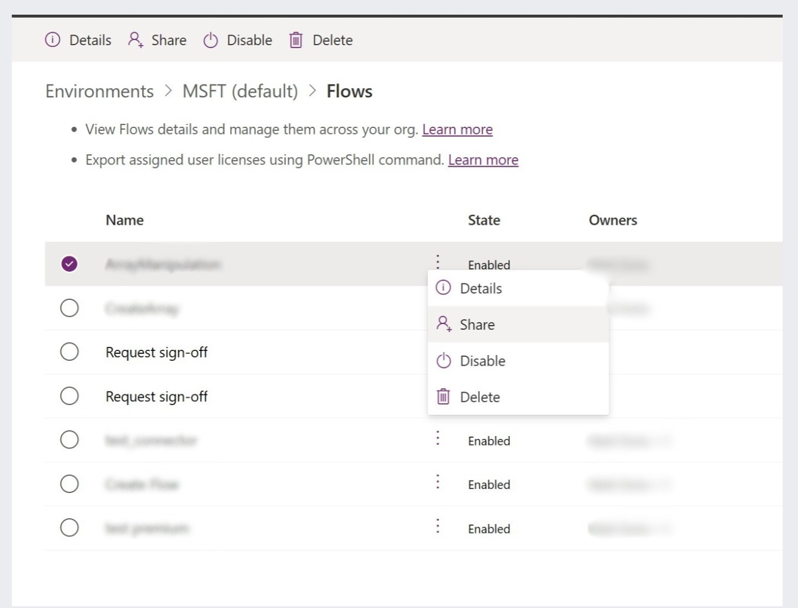

One of the operational task that many M365 admins is to maintain a current inventory of all Power Automate flows living inside their tenants. The real problem though is everytime a tenant user creates a new flow, tenant admins doesn't have the direct access to view/modify those flows. And if that particular user leaves the company there would be an unmonitored flow that may break without anyone being notified.

In this post, we will discuss how to add/change the Power Automate Owners using powershell.
<!--truncate-->
## Pre-requisites
:::info

At a minimum, **Power Platform Admin** role is needed to execute the steps below.

:::

## Manual through UI

As an admin, you can go to [Power Platform Admin](https://pp.cmd.ms) > Environments > Select Environment > Under Resources > Select Flows and you will be presented with all the flows in your environment. You can individually share or enable these flows using this screen.




## Automate using PowerShell
### Install Modules

You first need to install the required modules.

```powershell
Install-Module -Name AzureAD -Scope CurrentUser
Install-Module -Name Microsoft.PowerApps.Administration.PowerShell -Scope CurrentUser
Install-Module -Name Microsoft.PowerApps.PowerShell -Scope CurrentUser
```

### Script Composition

#### Define UPN
```powershell
#Define User Principal Name of the new owner
$upn = username@tenant.com
```

#### Get ObjectID in Azure AD
Login using the Power Platform Admin user account
```powershell
#Get Object ID of new owner
Connect-AzureAd
$adUser = Get-AzureAdUser -ObjectID $upn | Select-Object ObjectId
```

#### Get All FLOWS
```powershell
#Get ALL flows accessible to Power Platform Admin
$flows = Get-AdminFlow
Write-Host -f Magenta "$($flows.Count) flows accessible to current user"
```

#### Traverse each flow
:::tip

Each time we run a **"Request sign off"** in a SharePoint Library, a new flow is created in the environment (shown [above](./index.md#manual-through-ui)). We don't need to change ownership of that flow hence we check the display name when we traverse.

:::

```powershell
#Traverse each flow and add new user as Owner for each
foreach ($flow in $flows) {
    // highlight-next-line
    if ($flow.DisplayName -ne "Request sign-off") {
        Write-Host -f Yellow "Adding user $upn to $($flow.DisplayName)"
        Set-AdminFlowOwnerRole `
            -EnvironmentName $flow.EnvironmentName `
            -FlowName $flow.FlowName `
            -RoleName CanEdit `
            -PrincipalType User `
            -PrincipalObjectId $adUser.ObjectId
        Write-Host -f Green "Successfully added $upn to $($flow.DisplayName)"
    }
}
```
### Combining everything

Let's combine everything we have
:::tip
    If you are using solutions in your environment, you need to make the new owner a **System Administrator for each environment**. If not, the script will get an **Error 403: Forbidden**.
:::


```powershell
#Define User Principal Name of the new owner
$upn = username@tenant.com

#Get Object ID of new owner
Connect-AzureAd
$adUser = Get-AzureAdUser -ObjectID $upn | Select-Object ObjectId

#Get ALL flows accessible to Power Platform Admin
$flows = Get-AdminFlow
Write-Host -f Magenta "$($flows.Count) flows accessible to current user"

#Traverse each flow and add new user as Owner for each
foreach ($flow in $flows) {
    if ($flow.DisplayName -ne "Request sign-off") {
        Write-Host -f Yellow "Adding user $upn to $($flow.DisplayName)"
        Set-AdminFlowOwnerRole `
            -EnvironmentName $flow.EnvironmentName `
            -FlowName $flow.FlowName `
            -RoleName CanEdit `
            -PrincipalType User `
            -PrincipalObjectId $adUser.ObjectId
        Write-Host -f Green "Successfully added $upn to $($flow.DisplayName)"
    }
}
```

