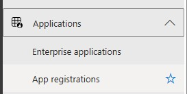

## What is happening on Sept 9th, 2024

As announced by the [PnP Powershell Team](https://pnp.github.io/blog/post/changes-pnp-management-shell-registration), the multi-tenant app registration will be deleted on September 9th, 2024. For those who are not familiar what this application looks like in your tenant, here is a screenshot:


<!--truncate-->

As quoted:
>This change is provided to help customers to improve their security posture by encouraging the use of single tenant app registrations with on just the scopes and permissions which are needed.
>
> -- PnP PowerShell Team

## Multi-Tenant App Registration

The Multi-Tenant App Registration was created by the PnP PowerShell Team in order to provide a quick way for M365 customers to utilize PnP.PowerShell module and connect to desired tenants. It can be downloaded and installed by M365 customers to provide scripting capabilities for their admins/users. This application provides [DELEGATED access](https://learn.microsoft.com/en-us/entra/identity-platform/delegated-access-primer) to the sites/services the user has access to. 

:::tip
Multi-Tenant App Registration has a set of [default permissions](./index.md#multi-tenant-app-permissions) which cannot be altered once installed. This is probably, in my opinion, the reason they are eliminating this app.
:::

Once connected to the tenant, you will be able to utilize the [PnP cmdlets](https://pnp.github.io/powershell/cmdlets/index.html) depending on your current access to the site.

### -Interactive
This is the old way of connecting to sites. If you only provide the "-Interactive" parameter, you are explicitly saying the command to use the multi-tenant app registration to connect.
:::warning
This line of code will be unusable after the changes on Sept 9th
:::
```powershell
Connect-PnPOnline [tenant].sharepoint.com -Interactive
```

## Using your own App Registration

To replace the Multi-Tenant App Registration provided by the PnP PowerShell team, customers must now create a new Application Registration to be able to utilize the PnP PowerShell Module. Admins will now be able to scope what particular permissions should be allowed when using the module.

:::tip
There are several ways to [connect](https://pnp.github.io/powershell/cmdlets/Connect-PnPOnline.html) using the module but we will only be focusing on the simplest one for now.
:::

### Creating an App Registration

1. Navigate to your **[Entra Admin Portal](https://aad.cmd.ms)**
2. Click on **Applications** > **App Registrations**



3. Click on **New Registration**


4. Fill out the **Name**. On the Redirect URI, Select **Public client/native (mobile & desktop)**, and then type in **"http://localhost"**. Hit **Register** at the bottom of the page.


5. Once created, copy the application id and save it for future reference.


### Adding Permissions

1. Navigate to **API Permissions**


2. Click on **Add Permission**


3. Find and click **SharePoint** (We will add SharePoint just for demo). We can also replicate the [Multi-Tenant App Permissions](./index.md#multi-tenant-app-permissions) afterwards.


4. Select **Delegated Permissions**


5. Find and Check on **AllSites.FullControl**. Hit **Add Permissions**.


6. Click on **Grant admin consent for [environment name]**. Hit **Yes** to the prompt.


### Use the newly created App Registration

Once the application is created, users can now use the line below to connect to tenants. **-ClientId** specifies that user is connecting using the newly registered application.

```powershell
Connect-PnPOnline [tenant].sharepoint.com -Interactive -ClientId [ApplicationID]
```


## Multi-Tenant App Permissions

For reference, here is the list of old permissions granted to the app.


